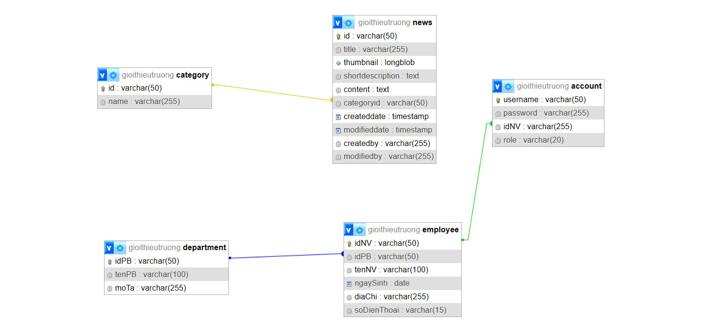

# Dự Án Quản Lý Nhân Viên

## Giới Thiệu Chung
Đây là bài tập lớn của bộ môn Lập trình mạng tại Đại học Bách Khoa Đà Nẵng (DHBK-DHDN). Dự án xây dựng một Website quản lý nhân viên và giới thiệu về khoa Công Nghệ Thông Tin (CNTT) của trường Đại học Bách Khoa Đà Nẵng.

## Các Vai Trò Trong Dự Án
- **Admin**: Quản lý các chức năng liên quan đến hệ thống và người dùng.
- **User**: Quản lý tài khoản cá nhân và tra cứu thông tin nhân sự.
- **Guest**: Xem các thông tin công khai trên trang web.

## Chức Năng Chính

### **Admin**
- Quản lý nhân viên
- Quản lý phòng ban
- Quản lý tài khoản
- Quản lý bài viết
- Quản lý thông báo

### **User**
- Quản lý tài khoản cá nhân
- Quản lý thông tin cá nhân
- Tra cứu nhân sự

### **Guest**
- Xem tin tức
- Xem các trang giới thiệu về khoa CNTT của DHBK-DHDN

## Cấu Trúc Dự Án

### **Cơ Sở Dữ Liệu**

Dự án sử dụng MySQL để lưu trữ thông tin về nhân viên, phòng ban, tài khoản người dùng, bài viết, và thông báo.

### **Backend**
- **JSP/Servlet**: Dùng để xử lý logic nghiệp vụ và kết nối với cơ sở dữ liệu.
- **MySQL**: Hệ quản trị cơ sở dữ liệu để lưu trữ dữ liệu.

### **Frontend**
- **JavaScript**: Để xử lý các thao tác giao diện người dùng và tương tác với backend.
- **HTML, CSS, jQuery**: Để xây dựng giao diện người dùng và tạo hiệu ứng động.

## Hướng Dẫn Cài Đặt

1. **Cài đặt MySQL**: Tải và cài đặt MySQL từ trang chính thức. Tạo cơ sở dữ liệu theo sơ đồ trong phần "Database".
2. **Chạy Backend**: Sử dụng Tomcat hoặc một máy chủ JSP/Servlet để triển khai ứng dụng backend.
3. **Chạy Frontend**: Mở file HTML trong trình duyệt để xem giao diện và sử dụng các tính năng của dự án.

## Demo Dự Án
Bạn có thể xem video demo của dự án tại [Google Drive](https://drive.google.com/file/d/1Apxx_p7U3rv0QEu4QjALQcZ9vb9UERZZ/view?usp=drive_link).
